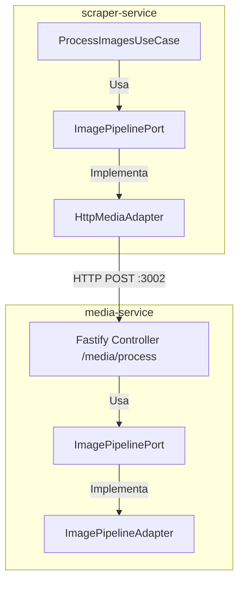
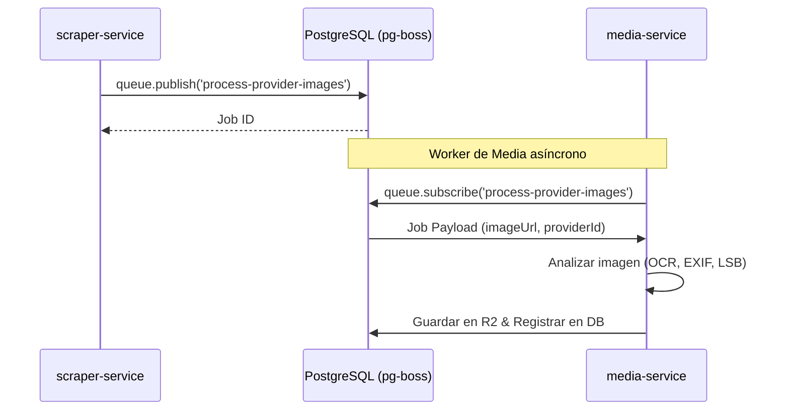

# 30 · Comunicación entre Scraper y Media Service

Este documento detalla el diseño de comunicación, interfaces, tipos fuertes y flujo asíncrono implementados para el procesamiento de imágenes entre **`scraper-service`** y el nuevo microservicio **`media-service`**.

---

## 1. Arquitectura de Comunicación (Ports & Adapters)

El procesamiento visual de imágenes en el scraper está totalmente desacoplado. El scraper no realiza operaciones de CPU pesadas de imagen (como OCR o redimensionamiento); en su lugar, delega esta tarea a `media-service` en el **Puerto 3002** mediante un puerto e interfaz limpia:



---

## 2. Contrato y Payload HTTP (Síncrono - Fase 1)

El adaptador `HttpMediaAdapter` se comunica con `media-service` mediante el endpoint síncrono `POST /media/process`.

### Petición (`POST /media/process`)
Para optimizar el ancho de banda, el endpoint soporta dos modos de envío:
1. **Descarga Directa desde URL (Recomendado para Scraper)**: El scraper solo envía la URL de origen de la imagen. `media-service` descarga directamente el buffer a memoria, eliminando el tráfico de red interno redundante.
2. **Buffer en Base64**: Para subidas internas que ya residen en memoria.

```json
{
  "imageUrl": "https://url-del-portal.com/foto.jpg", // Opcional
  "imageBufferBase64": "...",                         // Opcional (si no viene imageUrl)
  "sourceName": "erosguia"                             // Opcional (para heurística de marca)
}
```

### Respuesta (JSON Serializado)
Devuelve el objeto canónico de procesamiento `ProcessedImageResult`:
```json
{
  "id": "e2a1b3...",
  "url": "https://url-del-portal.com/foto.jpg",
  "status": "ok", // ok | rejected
  "rejectReason": null,
  "hashes": {
    "sha256": "a3b2c1...",
    "phash": "f00f0f..."
  },
  "metadata": {
    "format": "webp",
    "width": 1200,
    "height": 900,
    "size": 154200,
    "exif": {
      "software": "ErosGuia Upload Engine",
      "copyright": "..."
    }
  },
  "ocrText": "...",
  "stegoText": "...",
  "detected": {
    "phones": [],
    "emails": [],
    "urls": [],
    "brands": ["ErosGuia"]
  },
  "flags": {
    "isNSFWCandidate": false,
    "hasSensitiveData": false,
    "hasText": true
  },
  "adapterAssessment": {
    "hasInjectedInfo": true,
    "injectedInfoTypes": ["exif_software"],
    "injectedInfoDetails": ["Marca ErosGuia detectada en metadatos Software"]
  },
  "normalizedBufferBase64": "...", // Buffer WebP optimizado serializado
  "thumbnailBufferBase64": "..."   // Buffer Thumbnail (150x150) serializado
}
```

---

## 3. Tipado de Colas Asíncronas (`JobName`)

Para evitar errores ortográficos y de tipeo al publicar o suscribir tareas en la cola (`pg-boss` o `InMemoryQueue`), **todos los nombres de tareas están fuertemente tipados**.

### Declaración en `QueuePort`
* **Ubicación**: `services/scraper-service/src/application/ports/queue.port.ts`
```typescript
export const JOB_NAMES = {
  PROCESS_PROVIDER_IMAGES: 'process-provider-images',
} as const;

export type JobName = (typeof JOB_NAMES)[keyof typeof JOB_NAMES];
```

### Consumo Seguro de Colas

#### A. Publicación (Estrategias de Persistencia)
Al consolidar un anuncio raspado, se publica el trabajo asíncrono utilizando la constante fuertemente tipada:
```typescript
await this.queue.publish(JOB_NAMES.PROCESS_PROVIDER_IMAGES, {
  providerId: 'provider-uuid-123',
  imageUrls: ['https://src.com/img1.jpg'],
  source: 'erosguia',
  vertical: 'dating'
});
```

#### B. Suscripción (DI Container)
El orquestador de colas en segundo plano procesa el trabajo con validación en tiempo de compilación:
```typescript
await queue.subscribe<ProcessImagesJobPayload>(
  JOB_NAMES.PROCESS_PROVIDER_IMAGES,
  async (payload) => {
    await processImagesUseCase.execute(payload);
  }
);
```

---

## 4. Evolución de Comunicación (Fase 2: Colas Directas)

Gracias al aislamiento total de la capa de infraestructura del `ImagePipelineAdapter` de `media-service`, es sumamente simple eliminar el protocolo HTTP para escalar el sistema a comunicación asíncrona pura mediante colas:



Si decidimos activar esta comunicación directa por base de datos/colas en el futuro, solo se requiere implementar un nuevo adaptador de colas en ambos extremos, dejando intacta la lógica de negocio y las etapas del pipeline.
