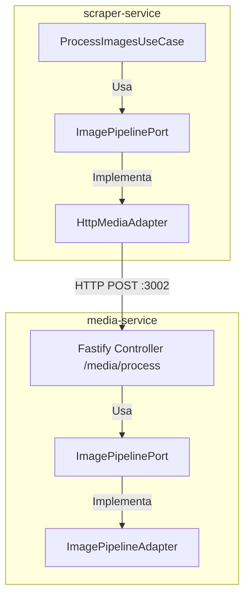
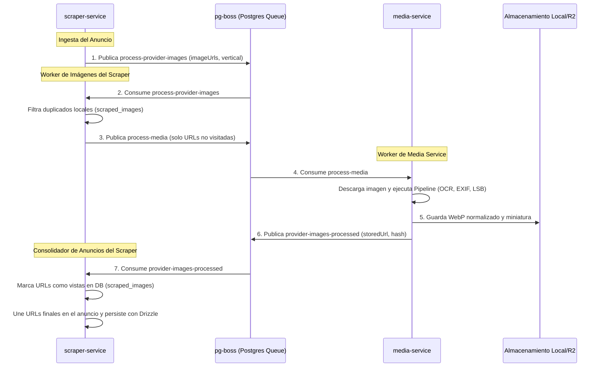

# 30 · Comunicación entre Scraper y Media Service

Este documento detalla el diseño de comunicación, interfaces, tipos fuertes y flujo asíncrono implementados para el procesamiento de imágenes entre **`scraper-service`** y el nuevo microservicio **`media-service`**.

---

## 1. Arquitectura de Comunicación (Ports & Adapters)

El procesamiento visual de imágenes en el scraper está totalmente desacoplado. El scraper no realiza operaciones de CPU pesadas de imagen (como OCR o redimensionamiento); en su lugar, delega esta tarea a `media-service` en el **Puerto 3002** mediante un puerto e interfaz limpia:



---

## 2. Contrato y Payload HTTP (Síncrono - Fase 1)

El adaptador `HttpMediaAdapter` se comunica con `media-service` mediante el endpoint síncrono `POST /media/process`.

### Petición (`POST /media/process`)

Para optimizar el ancho de banda, el endpoint soporta dos modos de envío:

1. **Descarga Directa desde URL (Recomendado para Scraper)**: El scraper solo envía la URL de origen de la imagen. `media-service` descarga directamente el buffer a memoria, eliminando el tráfico de red interno redundante.
2. **Buffer en Base64**: Para subidas internas que ya residen en memoria.

```json
{
  "imageUrl": "https://url-del-portal.com/foto.jpg", // Opcional
  "imageBufferBase64": "...", // Opcional (si no viene imageUrl)
  "sourceName": "erosguia" // Opcional (para heurística de marca)
}
```

### Respuesta (JSON Serializado)

Devuelve el objeto canónico de procesamiento `ProcessedImageResult`:

```json
{
  "id": "e2a1b3...",
  "url": "https://url-del-portal.com/foto.jpg",
  "status": "ok", // ok | rejected
  "rejectReason": null,
  "hashes": {
    "sha256": "a3b2c1...",
    "phash": "f00f0f..."
  },
  "metadata": {
    "format": "webp",
    "width": 1200,
    "height": 900,
    "size": 154200,
    "exif": {
      "software": "ErosGuia Upload Engine",
      "copyright": "..."
    }
  },
  "ocrText": "...",
  "stegoText": "...",
  "detected": {
    "phones": [],
    "emails": [],
    "urls": [],
    "brands": ["ErosGuia"]
  },
  "flags": {
    "isNSFWCandidate": false,
    "hasSensitiveData": false,
    "hasText": true
  },
  "adapterAssessment": {
    "hasInjectedInfo": true,
    "injectedInfoTypes": ["exif_software"],
    "injectedInfoDetails": ["Marca ErosGuia detectada en metadatos Software"]
  },
  "normalizedBufferBase64": "...", // Buffer WebP optimizado serializado
  "thumbnailBufferBase64": "..." // Buffer Thumbnail (150x150) serializado
}
```

---

## 3. Tipado de Colas Asíncronas (`JobName`)

Para evitar errores ortográficos y de tipeo al publicar o suscribir tareas en la cola (`pg-boss` o `InMemoryQueue`), **todos los nombres de tareas están fuertemente tipados**.

### Declaración en `QueuePort`

- **Ubicación**: `services/scraper-service/src/application/ports/queue.port.ts`

```typescript
export const JOB_NAMES = {
  PROCESS_PROVIDER_IMAGES: 'process-provider-images',
} as const;

export type JobName = (typeof JOB_NAMES)[keyof typeof JOB_NAMES];
```

### Consumo Seguro de Colas

#### A. Publicación (Estrategias de Persistencia)

Al consolidar un anuncio raspado, se publica el trabajo asíncrono utilizando la constante fuertemente tipada:

```typescript
await this.queue.publish(JOB_NAMES.PROCESS_PROVIDER_IMAGES, {
  providerId: 'provider-uuid-123',
  imageUrls: ['https://src.com/img1.jpg'],
  source: 'erosguia',
  vertical: 'dating',
});
```

#### B. Suscripción (DI Container)

El orquestador de colas en segundo plano procesa el trabajo con validación en tiempo de compilación:

```typescript
await queue.subscribe<ProcessImagesJobPayload>(
  JOB_NAMES.PROCESS_PROVIDER_IMAGES,
  async (payload) => {
    await processImagesUseCase.execute(payload);
  },
);
```

---

## 4. Arquitectura Asíncrona de Extremo a Extremo (Fase 2 - Producción)

Hemos implementado por completo el **Desacoplamiento Asíncrono Basado en Eventos (Event-Driven Architecture)** mediante colas de base de datos (`pg-boss` / `InMemoryQueue`). Con este flujo, el scraper queda 100% desligado de la descarga, procesamiento, normalización y almacenamiento de imágenes.

### Flujo de Trabajo e Interacción

El procesamiento y consolidación asíncrona se gestiona mediante cuatro etapas secuenciales coordinadas por colas compartidas en PostgreSQL:



### Contratos de Colas Centralizados (`@allcoba/shared-types`)

Todos los nombres de tareas y payloads están centralizados en la capa compartida del monorepo (`packages/shared-types/src/domain/queue.ts`) garantizando tipado estático y sincronización absoluta entre productores y consumidores:

```typescript
export const JOB_NAMES = {
  PROCESS_PROVIDER_IMAGES: 'process-provider-images',
  PROCESS_MEDIA: 'process-media',
  PROVIDER_IMAGES_PROCESSED: 'provider-images-processed',
} as const;

export type JobName = typeof JOB_NAMES[keyof typeof JOB_NAMES];
```

### Responsabilidades Clave por Servicio

#### 1. `scraper-service`
* **Productor Inicial**: Encola la petición de captura de imágenes de un proveedor externo.
* **Filtrador**: Compara la lista de URLs contra la base de datos PostgreSQL (`scraped_images`) y solo encola en `process-media` aquellas que realmente requieran descarga y normalización.
* **Consolidador**: Consume los resultados de `provider-images-processed` y actualiza atómicamente el registro del anuncio original en Drizzle con las nuevas rutas `storedUrl` y hashes calculados.

#### 2. `media-service`
* **Procesador Autónomo**: Descarga las imágenes directamente desde las URLs de origen remotas hacia su memoria.
* **Orquestador del Pipeline**: Ejecuta secuencialmente el filtro temprano, normalización WebP, análisis de metadatos TIFF, esteganografía LSB y extracción OCR de marcas de agua.
* **Administrador de Almacenamiento**: Utiliza el `LocalStorageAdapter` (o `S3StorageAdapter` en staging/producción) para persistir la imagen normalizada y el thumbnail directamente en el storage y notificar el éxito.

