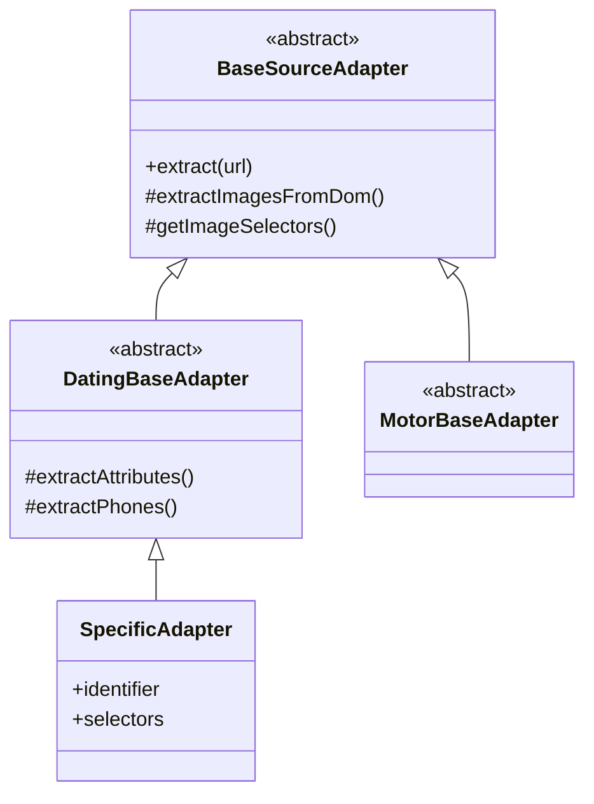

# SOURCES.md — services/scraper-service/src/infrastructure/adapters/sources

> Sistema de adaptadores para la extracción de datos crudos (HTML/JSON) desde fuentes externas.
> Implementa una arquitectura jerárquica para desacoplar el crawler de la lógica específica de cada dominio.
> Los adaptadores son "pasivos": reciben un DOM/Response y devuelven datos normalizados.

---

## Arquitectura

El sistema se basa en una jerarquía de clases para maximizar la reutilización de código y garantizar la consistencia entre verticales:



1.  **`BaseSourceAdapter`**: Define el flujo principal de navegación (Playwright/Cheerio), manejo de cookies, rotación de User-Agents y lógica base de extracción de imágenes.
2.  **Vertical Base (`DatingBaseAdapter`, `MotorBaseAdapter`, etc.)**: Implementa lógica común para todos los sitios de una misma industria.
3.  **Adaptador Específico**: Contiene los selectores CSS y la lógica particular de un dominio concreto.

## Comandos Rápidos

```bash
# Ejecutar tests de una vertical específica
npx vitest run __tests__/unit/infrastructure/adapters/sources/dating/

# Ejecutar un test de un adaptador concreto
npx vitest run __tests__/unit/infrastructure/adapters/sources/dating/madrid69.adapter.spec.ts

# Verificar tipos en los adaptadores
npx tsc --noEmit
```

## Nomenclatura Estándar de Selectores

Es CRÍTICO usar nombres estandarizados para que las clases base puedan extraer información automáticamente.

| Selector       | Propósito                        | ✅ Bien    | ❌ Mal (Evitar)                |
| :------------- | :------------------------------- | :--------- | :----------------------------- |
| **`title`**    | Título principal de la página    | `title`    | `mainTitle`, `adTitle`         |
| **`nickname`** | Nombre/Alias del usuario         | `nickname` | `name`, `alias`, `user`        |
| **`gallery`**  | Todas las imágenes del perfil    | `gallery`  | `photos`, `images`, `carousel` |
| **`phone`**    | Enlaces o texto de teléfono      | `phone`    | `tel`, `telephone`, `call_btn` |
| **`whatsapp`** | Enlaces a WhatsApp               | `whatsapp` | `wa_link`, `ws_app`            |
| **`nextPage`** | Enlace de paginación "Siguiente" | `nextPage` | `next`, `pagination_btn`       |
| **`cookies`**  | Botón de aceptar cookies         | `cookies`  | `cookieBtn`, `acceptAll`       |
| **`ageGate`**  | Botón de confirmación de edad    | `ageGate`  | `plus18`, `verifyAge`          |

## Sistema de Recogida de Imágenes

La extracción de imágenes en `BaseSourceAdapter` es inteligente y automatizada.

### 1. Extracción Automática (`gallery`)

El motor busca en el selector `gallery` y procesa automáticamente:

- Etiquetas ``: Atributos `src`, `data-src`, `data-lazy`, `srcset`.
- Etiquetas `<picture>`: Evalúa todos los `<source>` y elige la mejor opción.
- Etiquetas `<a>`: Si el enlace apunta a una imagen (jpg, png, etc.).
- Estilos `background-image`: Extrae la URL de la propiedad CSS.

### 2. Prioridad de Formatos y Calidad

El sistema aplica una lógica de **"Pick Best"**:

- **Formato**: Prefiere `webp` o `avif` sobre `jpg`/`png` si están disponibles en el mismo `srcset`.
- **Resolución**: Si hay múltiples tamaños en `srcset`, elige el de mayor resolución.

### 3. Transforms y Normalización

- **URLs Relativas**: Se resuelven automáticamente usando la `baseUrl`.
- **De-duplicación**: Se eliminan duplicados exactos.
- **Filtrado**: Se descartan trackers e imágenes de menos de 10px (placeholder detection).

## Patrones de Código y Reglas de Oro

### 1. Tipado Seguro

- Usa siempre `as const satisfies Record<string, SelectorDef>` en el objeto `selectors`.
- **Prohibido**: El uso de `!` (non-null assertion).

### 2. Extracción No-DOM (APIs Interceptadas)

Para sitios CSR (Next.js/React) donde las imágenes vienen de una API:

1. Activar `captureNetwork: true` en el método `extract`.
2. Interceptar en `onNetworkCaptured`.
3. Sobreescribir `extractImagesFromDom` para combinar los datos.

```typescript
protected override extractImagesFromDom($: CheerioAPI): string[] {
  const urls = new Set<string>(super.extractImagesFromDom($));
  this._profile?.fotos?.forEach(f => urls.add(f.url));
  return Array.from(urls);
}
```

## Tareas Comunes

### Añadir una Nueva Fuente

1. Crear el archivo `{sitio}.adapter.ts` en la carpeta de la vertical.
2. Heredar de la clase base correspondiente.
3. Definir el bloque JSDoc con los metadatos.
4. Definir los `selectors` usando la nomenclatura estándar.
5. Registrar en `source.registry.ts`.
6. Crear test unitario en `__tests__/unit/infrastructure/adapters/sources/{vertical}/{sitio}.adapter.spec.ts`.

---

_Detalles específicos de Dating: [DATING-SOURCES.md](./dating/DATING-SOURCES.md)_
